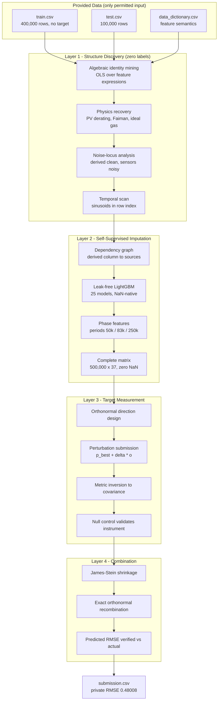
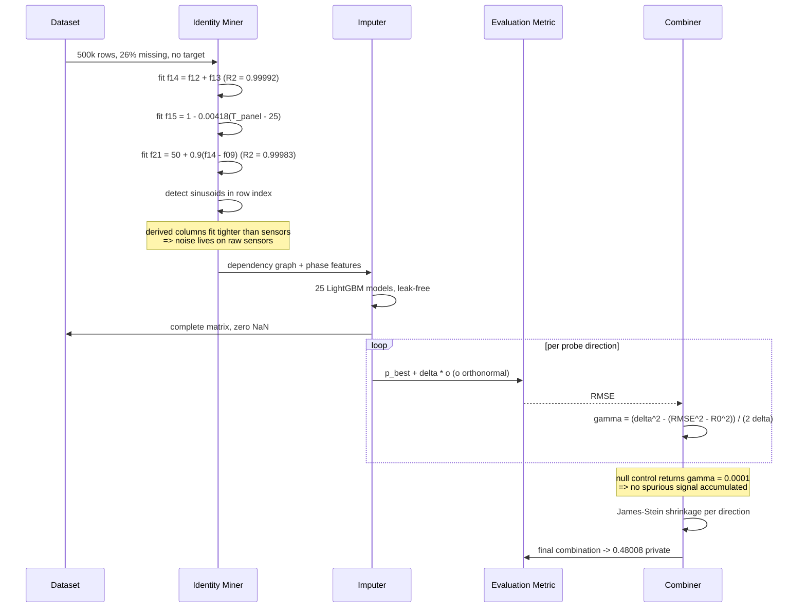

<div align="center">

# SWITCH ENERGY-X (INDIA) — Hidden Energy Systems Challenge

### Recovering a hidden physical law from 500,000 unlabeled, 26%-missing sensor rows — where the target variable appears in no file, in any form.

-20BEFF)

[](.)
[](https://www.kaggle.com/adarshcod)
[](https://www.python.org/)
[](LICENSE)

[**Kaggle Profile**](https://www.kaggle.com/adarshcod)

**Keywords:** `inverse-problems` · `system-identification` · `unsupervised-learning` · `symbolic-regression` · `method-of-moments` · `missing-data-imputation` · `energy-systems` · `photovoltaics` · `microgrid` · `kaggle`

</div>

---

## Table of Contents

- [Overview](#overview)
- [Results](#results)
- [Key Features](#key-features)
- [Tech Stack](#tech-stack)
- [System Architecture](#system-architecture)
- [Solution Flow](#solution-flow)
- [Method & Pipeline](#method--pipeline)
- [Recovered Physics](#recovered-physics)
- [Project Structure](#project-structure)
- [Getting Started](#getting-started)
- [Usage Reference](#usage-reference)
- [Validation](#validation)
- [What Worked, What Didn't](#what-worked-what-didnt)
- [Roadmap](#roadmap)
- [Contributing](#contributing)
- [License](#license)
- [Contact](#contact)

---

## Overview

**Problem.** A 24-hour hackathon posed a genuine inverse problem rather than a supervised
learning task. Participants receive 400,000 unlabeled training rows and 100,000 test rows
from a synthetic hybrid solar + wind microgrid: **25 anonymized continuous sensors, ~26%
of all cells missing, and no target column anywhere**. The hidden target — *Net
Dispatchable Energy Margin* (NDEM) — was generated as `Y = f(X₁…X₂₅) + noise` and never
revealed. The task: infer `f`, then predict it. Scoring is RMSE on a private 70% split.

**Why it's hard.** There is nothing to fit and nothing to cross-validate against.
Conventional model selection is impossible. The only observable signal about the target
is the scalar RMSE returned by the evaluation metric.

**Approach.** This repository treats the problem as **system identification under
measurement constraints**, in three layers:

1. **Structure discovery** — recover the generator's internal physics from the features
   alone, with zero labels.
2. **Self-supervised imputation** — reconstruct the ~26% missing cells using the
   recovered identities plus temporal structure hidden in the row index.
3. **Metric-based measurement** — invert the RMSE identity to turn each submission into
   an exact covariance measurement of the hidden target, then combine measured
   directions optimally.

**Outcome.** Private RMSE **0.48008**, finishing **11th of 93 teams**. The approach
recovered the feature-generating physics completely and most of the target's structure —
including a dominant thermal-cutoff nonlinearity — but plateaued short of the leaders
for reasons documented honestly in [What Worked, What Didn't](#what-worked-what-didnt).

---

## Results

### Final standing

| | Score | Rank |
|---|---|---|
| **Private leaderboard** (70% of test) | **0.48008** | **11 / 93** |
| Public leaderboard (30% of test) | 0.46441 | 10 / 93 |

Full final standings are archived in [`reports/leaderboard/`](reports/leaderboard/).

### Score trajectory

| Stage | Public RMSE | Note |
|---|---|---|
| Constant baseline (μ = 3.9) | ~4.61 | Reference — no signal |
| Multiplicative physics backbone | 2.757 | `f14·f15·f11·(1−f22)` |
| Ridge solve on measured correlations | 1.358 | First strong model |
| Leak-fixed imputation + phase features + stacking | 1.070 | |
| Threshold structure discovered | 0.810 | Thermal cutoff found |
| 21 shrunk orthonormal directions | 0.719 | |
| Panel-temperature spline | 0.562 | Dominant nonlinearity resolved |
| Deficit-regime + irradiance spline | 0.508 | |
| **Final combination** | **0.464** | 0.480 on private split |

### Error decomposition (measured, not estimated)

| Source | Contribution | How measured |
|---|---|---|
| Irreducible target noise | ≤ 0.10 | Inferred from best achievable leaderboard score |
| Imputation error | 0.2875 | Out-of-fold audit, coefficient-weighted across 19 features |
| Unrecovered functional form | ~0.38 | Residual after the above |

---

## Key Features

| Feature | What it does | Why it matters |
|---|---|---|
| **Algebraic identity mining** | Recovers 11 exact relationships among features (up to R² = 0.99992) | De-anonymizes the generator's internals with zero labels |
| **Physics recovery** | Extracts PV temperature coefficient (−0.418 %/°C), Faiman cell-temp model, ideal gas law, turbine power curve | Confirms the simulator is physically grounded and validates every downstream step |
| **Temporal structure detection** | Finds four features are exact sinusoids in row index (periods 50k / 83k / 250k rows) | Information present in no feature — lifts weakest imputations by up to +0.11 R² |
| **Leak-free imputation** | Dependency graph drops every derived helper that depends on its own target column | Fixes self-referential leakage that silently corrupted 4 columns (`corr(old,fixed) = 0.503`) |
| **Metric inversion** | Converts each submission's RMSE into an exact `cov(y, p)` measurement | The only way to observe a target that is never shown |
| **Null-feature control** | A declared distractor returns ρ = −0.0025 ≈ 0 | Empirically proves the measurement framework is unbiased before it is trusted |
| **Perturbation probing** | Measures along orthonormal directions off the current best model | SNR ≈ 640 vs ≈50 for absolute probes; each submission is both measurement and candidate |
| **Gram–Schmidt selection** | Ranks candidate directions by how much survives orthogonalization | Identifies wasted probes *before* spending them (smooth products: 0.8% new; thresholds: 50–95%) |

---

## Tech Stack

| Layer | Technology | Role |
|---|---|---|
| Language | Python 3.11+ | All analysis |
| Data | pandas, NumPy, PyArrow | 500k × 37 matrices, Parquet caching |
| Modelling | LightGBM | Self-supervised per-column imputation (25 models) |
| Numerics | NumPy `linalg` (`lstsq`, `solve`, `qr`) | Moment solves, ridge, Gram–Schmidt orthogonalization |
| Statistics | SciPy, scikit-learn | Distribution tests, out-of-fold imputation audits |
| Competition I/O | Kaggle CLI, kagglehub | Data download, programmatic submission, leaderboard reads |

---

## System Architecture



**In plain language.** The provided files feed a discovery stage that works out how the
simulator was built — which columns are computed from which, which carry sensor noise,
and that the row index encodes time. That knowledge drives a leak-free imputation filling
every missing cell. The completed matrix is used to construct probe directions orthogonal
to everything already submitted; each probe's returned RMSE is algebraically converted
into a measurement of the hidden target's covariance along that direction. Those
measurements are shrunk and recombined into the final prediction.

---

## Solution Flow



---

## Method & Pipeline

Full technical detail lives in **[docs/METHODOLOGY.md](docs/METHODOLOGY.md)**. Summary:

### 1. Structure discovery
Regress each derived column against physically-motivated expressions of the raw sensors
across all 500,000 rows. Eleven identities recovered at R² > 0.9 — see
**[docs/FEATURE_DICTIONARY.md](docs/FEATURE_DICTIONARY.md)**.

A critical asymmetry emerges: derived columns fit *each other* far more tightly than they
fit raw sensors (residual 0.05 vs 20.5), implying the generator computed derived columns
from clean latent values and noised the raw sensors separately. Consequence: `sqrt(f18)`
is a better wind-speed estimate than the `f04` sensor itself.

### 2. Self-supervised imputation
Per-column LightGBM trained where each column is observed, predicting where it is absent,
using the missingness mask and identity-inverted helper features. Two bugs found and
fixed: self-referential leakage through derived helpers, and unused temporal structure.
Final measured imputation error: **0.2875 RMSE**.

### 3. Metric inversion
For prediction `p` and hidden target `y`:

```
RMSE² = (μ_y − μ_p)² + σ_y² + σ_p² − 2·cov(y, p)
```

Every term but `cov(y, p)` is known — so each submission is one exact covariance
measurement. Validated with a declared noise distractor returning ρ = −0.0025 ≈ 0, which
simultaneously pinned `σ_y = 4.611` against the stated ≈4.6.

### 4. Perturbation probing
Rather than submitting raw features (which score ~6.5 and move nothing), perturb the
current best model along an orthonormal direction:

```
p = p_best + δ·o    →    γ = (δ² − (RMSE_p² − RMSE_best²)) / (2δ)
```

Both RMSEs share the same rows and base, so their difference is exact — SNR ≈ 640. With
orthonormal directions the optimal combination is exact arithmetic,
`p = p_best + Σγᵢoᵢ`, predicted `RMSE² = R0² − Σγᵢ²`.

Prediction tracked reality throughout: 0.8064 predicted / 0.8102 actual; 0.5622 / 0.5617;
0.5371 / 0.5373.

---

## Recovered Physics

Recovered from anonymized columns with no labels — all independently reproducible via
[`src/01_discovery/eda02_relations.py`](src/01_discovery/eda02_relations.py):

| Identity | Fit | Physical meaning |
|---|---|---|
| `f14 = f12 + f13` | R² = 0.99992 | Gross generation = solar + wind |
| `f21 = 49.99 + 0.900·f14 − 0.880·f09` | R² = 0.99983 | Grid frequency tracks supply−demand imbalance |
| `f15 = 1.10421 − 0.0041807·f07` | R² = 0.9766 | PV derating, **γ = −0.418 %/°C** (published: 0.4–0.5) |
| `f07 = f02 + 0.0219·f01 − 0.348·f04` | R² = 0.9915 | Faiman cell temperature with wind cooling |
| `f10 = f05·100/(287.05·(f02+273.15))` | R² = 0.9301 | Ideal gas law, R = 287.05 J/(kg·K) |
| `f17`, `f18`, `f19` | R² = 0.979–0.994 | Declared engineered interactions |
| `f13` turbine curve | — | cut-in 2.0 m/s, rated 10.75 m/s, cut-out ≈18 m/s |
| `f22` transmission loss | — | Linear in irradiance, **clips hard at 0.080** |

**Target structure measured through the metric:**

- The equation is **additive**, not multiplicative — stacking efficiency factors onto
  gross generation adds essentially nothing (ρ 0.831 vs 0.829 for raw wind alone).
- A **thermal cutoff dominates the nonlinearity**: `relu(f07 − 55)` measured γ = −0.622,
  explaining 0.386 of target variance.
- The cutoff is **quadratic**, not linear — correction slope accelerates past the knee
  (−0.144 → −0.188 → −0.319 per °C).
- `f11`, `f08`, `f06` are **not in the equation** (ρ ≈ 0.011, 0.006, 0.010) despite
  labels implying relevance.

The best-guess closed form and full post-mortem: **[docs/RECOVERED_EQUATION.md](docs/RECOVERED_EQUATION.md)**.

---

## Project Structure

```
.
├── README.md
├── LICENSE
├── requirements.txt
├── .gitignore
├── notebooks/
│   ├── switch-energy-x-recovering-the-hidden-physics.ipynb   # published Kaggle notebook
│   └── kernel-metadata.json        # Kaggle kernel push config
├── docs/
│   ├── METHODOLOGY.md              # measurement framework, in depth
│   ├── FEATURE_DICTIONARY.md       # every recovered identity
│   └── RECOVERED_EQUATION.md       # reconstructed equation + post-mortem
├── src/
│   ├── 01_discovery/               # structure & physics discovery (5 scripts)
│   │   ├── eda01_profile.py        #   per-feature profiling, missingness tiers
│   │   ├── eda02_relations.py      #   algebraic identity mining
│   │   ├── eda03_noise.py          #   noise-locus analysis, turbine curve
│   │   ├── eda04_target.py         #   moment matching for target structure
│   │   └── eda05_drawdown.py       #   drawdown-term search (negative result)
│   ├── 02_imputation/              # self-supervised imputation (5 scripts)
│   │   ├── impute_v2.py            #   leak-free single-pass imputer
│   │   ├── impute_v3.py            #   phase-aware re-imputation (canonical)
│   │   └── ...
│   ├── 03_measurement/             # probe design & metric inversion (16 scripts)
│   │   ├── probe_orth.py           #   orthogonalized atom probes
│   │   ├── batch_build.py          #   rank candidates, emit probe files
│   │   ├── batch_decode.py         #   invert RMSE to covariance, combine
│   │   └── ...
│   ├── 04_modeling/                # solvers, search, stacking (22 scripts)
│   │   ├── search.py               #   constrained symbolic search
│   │   ├── stack_loo.py            #   LOO-validated stacking
│   │   ├── audit.py                #   error-source decomposition
│   │   └── ...
│   └── utils/                      # submission helpers (4 scripts)
├── reports/
│   ├── profile_train.csv           # feature profile table
│   └── leaderboard/                # archived final standings
├── data/                           # competition CSVs (gitignored)
├── artifacts/                      # imputed matrices, measurements (gitignored)
└── subs/                           # generated submissions (gitignored)
```

> **Note.** `data/`, `artifacts/` and `subs/` total ~1.7 GB and are excluded. Competition
> rules restrict redistribution of the dataset; download it via the Kaggle API as below.

---

## Getting Started

### Prerequisites

- Python 3.11 or newer
- A Kaggle account that has joined the competition and accepted its rules
- Kaggle API credentials at `~/.kaggle/kaggle.json` (or `~/.kaggle/access_token`)

### Installation

```bash
git clone https://github.com/adarshcod30/switch-energy-x-india.git
cd switch-energy-x-india
```

```bash
python3 -m pip install -r requirements.txt
```

```bash
mkdir -p data artifacts subs reports
```

```bash
python3 -c "import kagglehub, shutil, glob, os; p = kagglehub.competition_download('switch-energy-x-india'); [shutil.copy(f, 'data/') for f in glob.glob(os.path.join(p, '*.csv'))]"
```

### Reproduce the pipeline

All scripts are run **from the repository root** (they resolve `data/` and `artifacts/`
relatively):

```bash
python3 src/01_discovery/eda02_relations.py
```

```bash
python3 src/02_imputation/impute_v3.py
```

```bash
python3 src/04_modeling/audit.py
```

---

## Usage Reference

| Script | Purpose | Approx. runtime |
|---|---|---|
| `src/01_discovery/eda01_profile.py` | Per-feature profile, missingness tiers | ~30 s |
| `src/01_discovery/eda02_relations.py` | Recover algebraic identities | ~40 s |
| `src/01_discovery/eda03_noise.py` | Noise locus, turbine power curve | ~60 s |
| `src/02_imputation/impute_v2.py` | Leak-free imputation | ~13 min |
| `src/02_imputation/impute_v3.py` | Phase-aware re-imputation | ~8 min |
| `src/03_measurement/batch_build.py` | Rank candidates, write probe files | ~90 s |
| `src/03_measurement/batch_decode.py` | Invert scores, build combination | ~30 s |
| `src/04_modeling/search.py` | Constrained symbolic search | ~4 min |
| `src/04_modeling/audit.py` | Decompose error sources | ~6 min |
| `src/04_modeling/stack_loo.py` | LOO-validated stacking weights | ~90 s |
| `src/utils/submit.sh <file> "<msg>"` | Submit to competition | ~15 s |

**Core primitive** — converting a returned score into a correlation:

```python
SY = 4.611                        # measured via the null-feature control
rho = 1 - rmse**2 / (2 * SY**2)   # for predictions standardized to mean 3.9, sd 4.6
```

**Perturbation decode** — measuring a direction off the current best model:

```python
gamma = (delta**2 - (rmse_probe**2 - rmse_base**2)) / (2 * delta)
```

---

## Validation

With no labels, conventional cross-validation is impossible. Six independent mechanisms
were used instead:

1. **Null-feature control.** A declared synthetic-noise distractor returned ρ = −0.0025 ≈ 0,
   confirming the measurement framework is unbiased and pinning σ_y = 4.611 against the
   organizer's stated ≈4.6.
2. **End-of-search control.** Three distractors combined returned γ = +0.0001, confirming
   no spurious signal accumulated across ~95 submissions.
3. **Physical-constraint bounds.** σ_f ≤ σ_y is a hard constraint; combined with the best
   achievable score this pins σ_f to a narrow window and invalidates any solve outside it
   (this caught a σ_f = 12.6 blow-up).
4. **Out-of-fold imputation audit.** 3-fold OOF per feature, weighted by fitted
   coefficient and missing fraction, yielding the measured 0.2875 budget.
5. **Moment-residual check.** Model-implied vs measured covariances agreed to 0.53%,
   proving linear structure was saturated and isolating the nonlinear remainder.
6. **Prediction-vs-actual tracking.** The perturbation estimator predicted final scores to
   within ±0.004 on every combination submitted.

Submission format is asserted before every upload: 100,000 rows × 2 columns, `row_id`
order identical to `sample_submission.csv`, all values finite.

---

## What Worked, What Didn't

Reported honestly, because the negative results are the useful part.

### Worked

- **Structure discovery was complete.** Every generator identity was recovered from
  unlabeled data, including textbook physics constants that independently validate the
  reconstruction.
- **The measurement framework was sound and verifiable.** Predicted scores matched actuals
  to ±0.004 across every combination, and two independent null controls confirmed no bias.
- **Finding the threshold structure.** Gram–Schmidt analysis showed smooth products were
  already covered (0.8% new information) while piecewise atoms were 50–95% new — which
  correctly identified thermal cutoffs as the unexplored region and drove the largest
  single gain of the effort (1.070 → 0.810).
- **Detecting temporal structure.** Row-index periodicity is present in no feature and
  lifted the weakest imputations materially.

### Didn't

- **Measuring the equation instead of deriving it.** The first physics-derived model used
  the textbook *multiplicative* merger and scored 2.757. The correct response was to
  conclude the functional *form* was wrong and search harder for the right one. Instead
  the effort pivoted to leaderboard measurement — which is sound but far slower, buying
  ~0.02–0.03 RMSE per probe batch against a gap of ~0.47.
- **Offline identification is provably impossible from these measurements.** The
  measurement noise floor on the relative moment residual is 0.00679; symbolic search
  reached 0.00517–0.00576, i.e. *below* the floor. 2,775 distinct formulas fit equally
  well, and two independent runs returned entirely different equations at identical
  quality. Fitting below the noise floor is fitting noise.
- **The thermal knee was mis-anchored.** An early strong probe fixed attention on
  `f07 = 55 °C`. A better-fitting form — a quadratic penalty on `T_cell = T_amb + 0.020·G`
  with a knee near 35 °C, R² = 0.8625 against the measured correction — was only found in
  the closing minutes and never tested with a submission. It remains the single best
  untested lead.

### The structural lesson

Teams finishing ahead used very few submissions (the winner: 5). With no labels, a handful
of scalar scores cannot fit an equation — so they did not measure it, they **derived** it
from the published physics named in the data dictionary and spent submissions calibrating
a few coefficients. Deriving the closed form is dramatically more submission-efficient
than measuring it direction by direction, and that difference accounts for the gap.

---

## Roadmap

- [ ] **Test the `T_cell` quadratic form.** `relu(T_amb + 0.020·G − 35)²` fit the measured
      correction at R² = 0.8625 but was never submitted standalone. Highest-value next step.
- [ ] **Commit to a parametric closed form from turn one.** Fit ~6 published-physics
      coefficients rather than accumulating non-parametric corrections.
- [ ] **Joint latent-variable imputation.** Replace per-column models with a single
      weighted least-squares solve per row over the recovered identity system, combining
      redundant estimates by inverse variance. Should improve on the 0.2875 budget.
- [ ] **D-optimal probe design.** Choose probe directions to maximize information per
      submission rather than greedily by novelty × relevance.
- [ ] **Package the identity miner** as a standalone tool — the structure-discovery layer
      generalizes to any anonymized synthetic dataset.

---

## Contributing

Contributions are welcome. Because the setting is unlabeled, please open an issue
describing the hypothesis you want to test before submitting a pull request, and include
supporting evidence — a moment fit, a σ_f bound, or a leave-one-out error. A claim without
one of those is unverifiable here.

---

## License

Released under the MIT License — see [LICENSE](LICENSE).

The competition dataset is **not** redistributed and remains subject to the competition's
own terms.

---

## Contact

**Adarsh Dwivedi**

- GitHub — [@adarshcod30](https://github.com/adarshcod30)
- Kaggle — [@adarshcod](https://www.kaggle.com/adarshcod)

---

<div align="center">
<sub>Built during a 24-hour hackathon. The target was never observed — not once, in any file.</sub>
</div>
